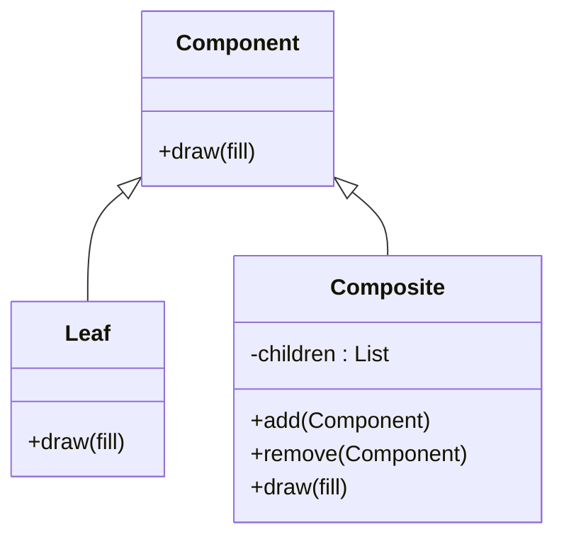
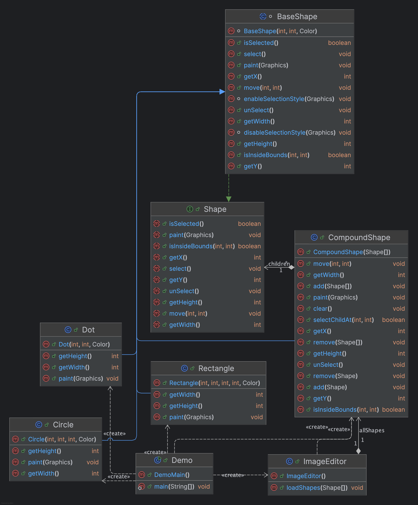

# Démonstration du Patron de Conception Composite (Java)

## 📌 Résumé

Ce projet Java démontre le **patron de conception Composite**, utilisé pour modéliser des structures hiérarchiques où les objets « feuille » et « composite » sont traités uniformément. Ce patron est largement utilisé dans des bibliothèques telles que **AWT/Swing**, **JSF**, ou **Wicket**, et facilite l’écriture de code récursif, modulaire et extensible.

## 💡 Pourquoi le patron Composite ?

Les applications modernes manipulent souvent des structures imbriquées (interfaces graphiques, systèmes de fichiers, organisations, etc.). Sans le patron Composite, le client doit tester explicitement la nature de chaque objet (feuille ou groupe), ce qui alourdit le code.

Le **Composite** définit une interface commune (`Component`), permettant au client de déclencher une même opération sur tous les éléments, indépendamment de leur type.

## 📚 Exemples d’usage dans l’écosystème Java

| API           | Élément Composite                | Élément Feuille          | Références |
|---------------|----------------------------------|---------------------------|------------|
| AWT/Swing     | `java.awt.Container`             | `java.awt.Button`, `Label`| [docs.oracle.com](https://docs.oracle.com) |
| JSF           | `javax.faces.component.UIComponent` | `HtmlOutputText`, etc. | java-design-patterns.com |
| Wicket        | `MarkupContainer`                | `Label`, `Link`          | java-design-patterns.com |
| Systèmes de fichiers | Répertoire (`Directory`)      | Fichier (`File`)         | refactoring.guru |

## 🧱 Description du patron Composite

### Participants

| Rôle      | Responsabilité principale |
|-----------|----------------------------|
| `Component` | Définit une interface commune (ex. `draw()`) |
| `Leaf`       | Implémente l’opération de base |
| `Composite`  | Gère une collection de `Component`, délègue récursivement |
| `Client`     | Manipule les éléments sans se soucier de leur type |

Ce modèle encourage la récursivité et masque la complexité de la structure hiérarchique.

### Diagramme Mermaid (UML simplifié)




## 💻 Exemple d’implémentation Java


- `Graphic` : interface de base
- `Circle`, `Triangle` : feuilles (Leaf)
- `Drawing` : composite
- `DemoComposite` : client qui orchestre l’ensemble

### Extrait de code – Composite (`Drawing`)

```java
public class Drawing implements Graphic {
    private final List<Graphic> children = new ArrayList<>();

    public void add(Graphic g)    { children.add(g); }
    public void remove(Graphic g) { children.remove(g); }

    @Override
    public void draw(String fill) {
        for (Graphic g : children) {
            g.draw(fill); // délégation récursive
        }
    }
}
```

### Extrait de code – Client (`DemoComposite`)

```java
public class DemoComposite {
    public static void main(String[] args) {
        Graphic triangle = new Triangle();
        Graphic circle = new Circle();

        Drawing logo = new Drawing();
        logo.add(triangle);
        logo.add(circle);

        Drawing banner = new Drawing();
        banner.add(logo);
        banner.add(new Triangle());

        banner.draw("rouge");
        banner.draw("bleu");
    }
}
```

### Sortie console (attendue)

```
● Triangle (rouge)
● Circle (rouge)
● Triangle (rouge)
● Triangle (bleu)
● Circle (bleu)
● Triangle (bleu)
```

## ✅ Avantages

- Traitement **uniforme** entre les feuilles et les composites.
- **Ajout** de nouveaux composants sans modifier le client.
- Simplifie la **récursivité** et favorise la **réutilisabilité**.
- Favorise une architecture orientée objet claire et modulaire.

## ⚠️ Limites

- L’interface `Component` peut devenir **trop large** si elle regroupe des méthodes inutiles pour certaines classes.
- Peut **ralentir** la performance dans des arbres très profonds ou massifs.
- Exige une **conception initiale rigoureuse**.

## 🛠️ Étapes futures

- Ajouter un **second patron de conception** non vu en cours (ex. : Memento, Flyweight, etc.).
- Intégrer les deux patrons dans un mini-projet Java commun avec **tests unitaires**.
- Capturer les **diagrammes UML** depuis Visual Paradigm.
- Préparer un **livrable final PDF/Word** pour présentation.

## 📖 Bibliographie

- [Refactoring Guru – Composite Pattern](https://refactoring.guru/design-patterns/composite)
- [DigitalOcean – Composite Pattern Java](https://www.digitalocean.com)
- [GeeksforGeeks – Guide Java 2025](https://www.geeksforgeeks.org)
- [IONOS – Analyse Forces/Faiblesses](https://www.ionos.ca)
- [Belatrix – Composite Benefits](https://belatrix.globant.com)
- [Oracle JavaDoc – Container](https://docs.oracle.com)
- [Java Design Patterns – Examples](https://java-design-patterns.com)

---

🎯 **Objectif pédagogique** : Ce projet permet de comprendre et d’implémenter le patron Composite en Java, tout en préparant un socle solide pour les projets architecturés autour de composants réutilisables.
